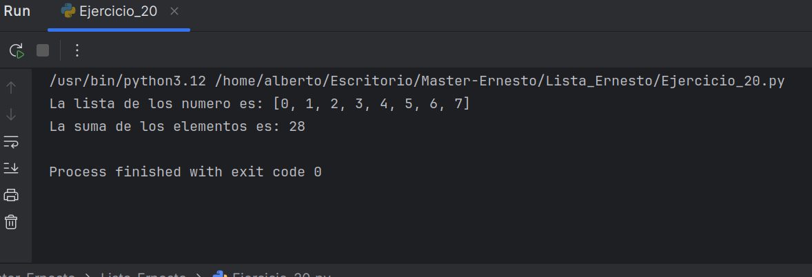

#  Manipulación Avanzada de Listas en Python
Descripción del Proyecto
Este repositorio contiene un script Python que demuestra la manipulación dinámica de listas, específicamente cómo modificar y extender una lista para cumplir con requisitos específicos, finalizando con la suma de sus elementos. Es ideal para entender operaciones básicas y avanzadas con listas en Python.

## Características Principales
Inserción al inicio: Agrega un elemento específico (el número 0) al comienzo de una lista existente.

Extensión de lista: Demuestra cómo extender una lista con múltiples elementos adicionales (en este caso, 6 y 7).

Suma total: Calcula y muestra la suma de todos los elementos de la lista resultante.

